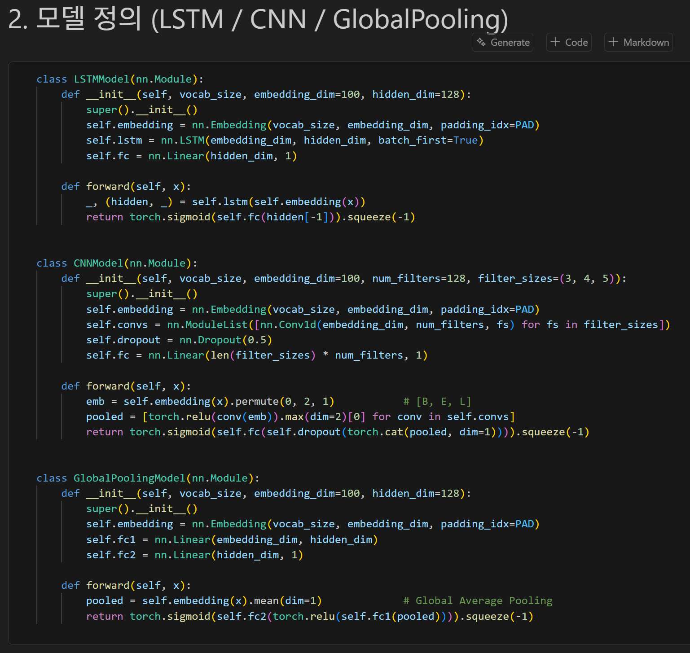
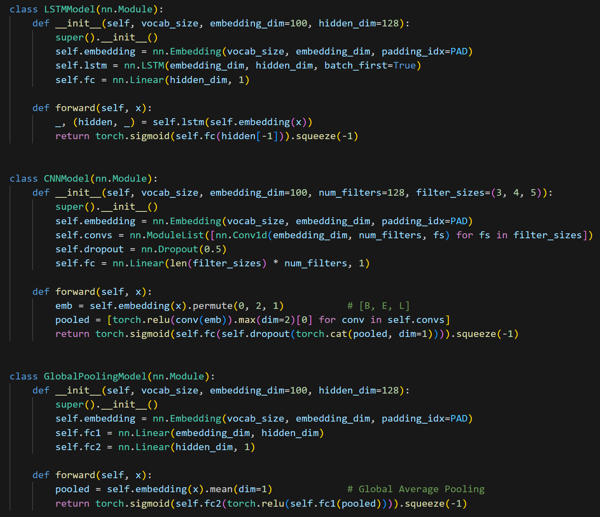

# AIFFEL Campus Online Code Peer Review Template
- 코더 : 김한울
- 리뷰어 : 김택훈

# PRT(Peer Review Template)

- [x] **1. 주어진 문제를 해결하는 완성된 코드가 제출되었나요?**
    - 데이터 전처리부터 LSTM, CNN, GlobalPooling 모델 비교와 Word2Vec 대조 실험까지 필요한 코드가 구성되어 있습니다.
    - 다만 노트북에 저장된 실행 결과가 없어 성능을 확인하기는 어렵습니다.
    - 근거: 셀 4~6의 데이터 전처리, 모델 학습 및 Word2Vec 비교 코드
    

- [x] **2. 핵심 코드에 작성된 주석 또는 doc string을 보고 코드가 잘 이해되었나요?**
    - 전처리 함수와 학습 함수에 doc string이 작성되어 있어 각 함수의 역할을 이해하기 쉬웠습니다.
    - CNN 모델의 `[B, E, L]` 주석은 임베딩 결과를 `Conv1d` 입력 형태로 변환하는 과정을 명확하게 보여 줍니다.
    - 

- [x] **3. 디버깅 기록 또는 새로운 시도와 추가 실험을 수행했나요?**
    - 특수 토큰이 빈 문자열이었던 문제와 NumPy 2.0에서 제거된 `np.Inf` 문제를 수정한 기록이 있습니다.
    - LSTM, CNN, GlobalPooling 세 모델을 비교하고, 사전학습 Word2Vec과 무작위 초기화 임베딩을 비교하는 추가 실험도 구성했습니다.
    - 근거: 첫 번째 마크다운 셀

- [ ] **4. 회고를 잘 작성했나요?**
    - 아직 작성을 못하셨다고 하심 

- [x] **5. 코드가 간결하고 효율적인가요?**
    - GPT Said :
    - 데이터 전처리, 학습, 시각화 과정이 함수로 분리되어 코드 중복이 적습니다.
    - 동일한 `train()` 함수를 여러 모델에 재사용하여 모델 간 비교 조건도 일관되게 유지했습니다.
    - `torch.no_grad()`와 `model.eval()`을 사용하여 평가 과정의 불필요한 gradient 계산을 방지했습니다.
    - 다만 LSTM은 길이가 다른 문장을 패딩한 후 마지막 hidden state를 사용하므로 `pack_padded_sequence()` 적용을 검토할 수 있습니다.
    - GlobalPooling 역시 padding을 포함하여 평균을 계산하므로 padding mask 기반 평균을 사용하면 문장 길이에 따른 희석을 줄일 수 있습니다.

# 회고(참고 링크 및 코드 개선)

코드가 전체적으로 간결하여 읽기가 쉬웠고, 제가 구현하지 않았던 globalpooling을 베이스로 대조하신 점이 좀 더 체계적인 실험 결과라고 느껴집니다. 

