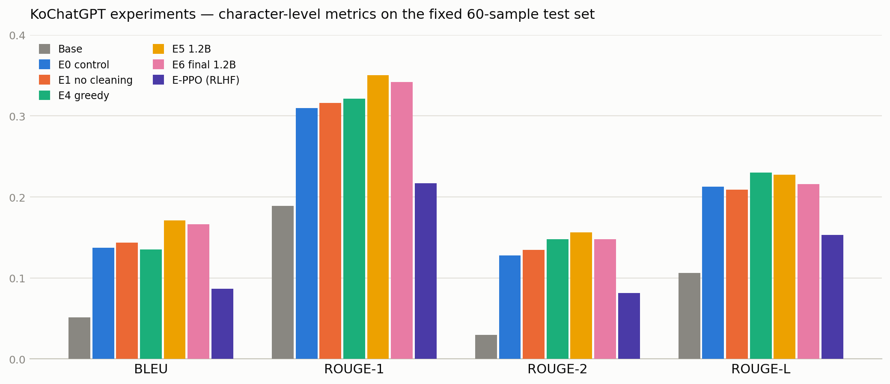

# KoChatGPT 업그레이드 — 변인 통제 실험 (Ablation Study)

KoGPT-2 기반 한국어 ChatGPT([KoChatGPT](https://github.com/airobotlab/KoChatGPT))의 성능을 좌우하는 요인을 분리 측정한 프로젝트입니다.
"데이터 정제, 디코딩 전략, 모델 크기, RLHF 중 무엇이 실제로 성능을 올리는가?"를 과학 실험처럼 **한 번에 변수 하나만 바꿔가며** 검증하고,
마지막에는 배운 것을 모두 합친 최종 모델(E6)과 RM+PPO 강화학습(E-PPO)까지 RLHF 3단계 전체를 완주했습니다.

## 요약 (TL;DR)

| 순위 | 요인 | 효과 |
|---|---|---|
| 1 | **지도 미세조정(SFT) 자체** | BLEU 2.7배 (0.05 → 0.14). "질문-답변 형식을 가르치는 것"의 효과가 압도적 |
| 2 | **모델 크기 (125M → 1.2B)** | BLEU +25%. 유일하게 전 지표 일관 개선 + 사실성 있는 답변 등장 |
| 3 | **데이터 정제** | 정량 지표 무승부(오차 범위 내), 정성 평가에서 아티팩트 제거·회피응답 감소 확인 |
| 4 | **디코딩 전략** | 성능 레버가 아닌 정확도(greedy) ↔ 다양성(샘플링) 트레이드오프 |
| — | **소규모 PPO (E-PPO)** | 정량 지표 **하락** — 작은 RM과 자동 생성 랭킹 데이터의 한계로 보상 해킹·생성 붕괴 관찰 (분석 참조) |

핵심 교훈 두 가지:

1. **지표는 품질의 대리인일 뿐이다** — 회피응답을 제거한 E6는 실제 답변 품질이 가장 좋았지만(회피 오프닝 6/10 → 0/10) 겹침 지표는 E5보다 낮았다. 참조 정답 자체가 회피성 문장을 포함하기 때문.
2. **RLHF는 공짜가 아니다** — 수업 자료의 예고대로, 정제된 보상 체계와 충분한 모델 크기 없이 PPO를 얹으면 오히려 성능이 무너진다. 이를 직접 재현·분석했다.

## 실험 설계

**통제 변인 (모든 실험 공통·고정)**: 무작위 시드 42, 동일한 held-out 테스트셋 60개, 동일한 문자 단위 BLEU/ROUGE 메트릭, 동일한 프롬프트 템플릿

| 실험 | 조작 변인 | 가설 |
|---|---|---|
| Base | (학습 안 함) | 파인튜닝 전 기준선 |
| E0 | — (대조군) | 정제 데이터 + KoGPT-2 + LoRA + 샘플링 디코딩 |
| E1 | 데이터 정제 OFF | 정제가 성능 향상에 기여했다 |
| E4 | 디코딩을 greedy로 고정 | 샘플링 디코딩의 기여분 분리 |
| E5 | 모델을 ko-gpt-trinity-1.2B(8bit)로 교체 | 지식 부족(오답)의 원인은 모델 크기다 |
| E6 | E5 + 손실 마스킹 + 회피응답 강화필터 + 데이터 증량(4k) + 디코딩 선발전 | 데이터·학습 기법으로 추가 개선 가능하다 |
| E-PPO | E0(SFT)에 RM 보상 기반 PPO 적용 | RLHF 3단계가 SFT 대비 성능을 올린다 |

- **모델**: [skt/kogpt2-base-v2](https://huggingface.co/skt/kogpt2-base-v2) (125M) / E5·E6는 [skt/ko-gpt-trinity-1.2B-v0.5](https://huggingface.co/skt/ko-gpt-trinity-1.2B-v0.5) + 8bit 양자화
- **데이터**: kochatgpt_1_SFT.jsonl 12,000쌍 (정제 후 학습 3,000~4,000개), RM은 kochatgpt_2_RM.jsonl 랭킹 쌍 2,000개, PPO는 kochatgpt_3_PPO.jsonl
- **학습**: PEFT LoRA (r=8~16, 전체 파라미터의 ~0.3%), Colab 무료 T4 GPU
- **평가**: 한국어(교착어) 특성을 고려한 문자 단위 BLEU, ROUGE-1/2/L + 다양성 지표 Distinct-2
- **공정성 장치**: 테스트셋 불변(E1의 원본 학습 데이터도 테스트 prompt 제외로 leakage 방지), E6의 디코딩 선발전은 별도 검증셋 20개로만 수행 (테스트셋 미접촉)

## 실행 방법

```
1. KoChatGPT_ablation_experiments.ipynb 를 Google Colab에서 열기 (런타임: T4 GPU)
2. 맨 위 셀의 EXPERIMENT = 'E0' 값만 바꾸고 전체 실행 → E0/E1/E4/E5
3. KoChatGPT_E6_final.ipynb 로 최종 모델 학습 (새 런타임 권장, ~50분)
4. E6 종료 후 같은 런타임에서 E6_RM_PPO_추가셀.py 의 셀 3개를 붙여넣어 RM+PPO 실행 (~20분)
5. 모든 결과는 results/experiments.csv 에 자동 누적
```

## 정량 결과

고정 테스트셋 60개, 문자 단위 측정:

| 실험 | BLEU | ROUGE-1 | ROUGE-2 | ROUGE-L | Distinct-2 | 학습시간 |
|---|---|---|---|---|---|---|
| Base | 0.0515 | 0.1888 | 0.0298 | 0.1063 | **0.5917** | 0분 |
| E0 (대조군) | 0.1374 | 0.3099 | 0.1277 | 0.2125 | 0.4675 | 1.7분 |
| E1 (정제 OFF) | 0.1436 | 0.3163 | 0.1346 | 0.2089 | 0.5124 | 2.2분 |
| E4 (greedy) | 0.1350 | 0.3212 | 0.1480 | **0.2299** | 0.4684 | 0분 (E0 재사용) |
| **E5 (1.2B)** | **0.1712** | **0.3501** | **0.1561** | 0.2275 | 0.4632 | 11.4분 |
| E6 (최종 1.2B) | 0.1665 | 0.3417 | 0.1479 | 0.2160 | 0.5487 | 31.0분 |
| E-PPO (RLHF) | 0.0865 | 0.2171 | 0.0816 | 0.1533 | 0.4717 | — |



## 변인별 분석

### SFT 자체의 효과 (Base vs E0)

가장 큰 단일 점프. Base는 질문을 그대로 이어 쓰거나(`### 불고기용 고기 한우는??` 무한 반복) 의미 없는 특수 토큰(`<1987><1989>`)을 출력하지만, SFT 후에는 "질문 → 완결된 답변" 형식을 따른다. 언어모델 본능(다음 토큰 잇기)을 대화 형식으로 교정하는 것이 모든 개선의 전제 조건.

### 데이터 정제 (E0 vs E1): 정량 무승부의 이유

BLEU 차이 +0.006 수준으로 오차 범위 내. 원인: ① 문자 겹침 지표는 '맞는 말'이 아니라 '비슷하게 생긴 말'에 점수를 준다 ② 참조 답변도 같은 ChatGPT 생성 데이터라 원본의 말투와 겹친다 ③ E1 답변이 더 길어(평균 106자 vs 70자) 재현율 성격의 ROUGE에 유리하다.

반면 정성 분석에서는 차이가 명확 — 학습 데이터의 성질이 출력에 그대로 전이됨:

| 항목 (저장된 생성문 10개 기준) | E0 (정제) | E1 (원본) |
|---|---|---|
| 답변이 `'`로 시작 (데이터 아티팩트) | **0 / 10** | **10 / 10** |
| 평균 답변 길이 | 70자 (간결) | 106자 (장황) |

### 디코딩 전략 (E0 vs E4)

greedy가 ROUGE-L에서 근소 우위(+0.017), 샘플링이 다양성에서 근소 우위. 디코딩은 모델이 아는 것을 바꾸지 못하고 "꺼내는 방식"만 바꾸므로 개선 폭에 상한이 있음이 확인됨.

### 모델 크기 (E0 vs E5): 유일한 일관 개선

전 지표 동반 상승 + 정성 변화가 뚜렷. 불고기 질문에 "마블링", "소의 등심이나 안심" 같은 실제 지식이 처음 등장했고, 미세먼지 질문에는 "실시간 정보는 모른다"며 자기 한계를 인지. "내용이 틀리는 진범은 모델 크기" 가설 지지. 대가는 학습시간 6.7배.

### 최종 모델 E6: 지표는 제자리, 품질은 최고 — 지표의 한계 실증

E5에 손실 마스킹(질문 부분 label=-100), 회피성 답변 강화 필터, 데이터 증량(1.5k→4k), 검증셋 기반 디코딩 선발전을 얹었다. 결과: 겹침 지표는 E5와 사실상 동률(BLEU 0.167 vs 0.171)이지만 **정성 품질은 명확히 최고**:

| 항목 | E5 | E6 |
|---|---|---|
| "저는 AI라서~" 회피 오프닝 (10개 중) | 6 | **0** |
| 불고기 질문 | 회피 후 일반론 | 회피 없이 바로 내용 답변 |

지표가 오르지 않은 이유가 이 프로젝트의 핵심 발견이다: **참조 정답 자체가 회피성 문장을 다수 포함**하므로, 회피 습관을 고친 모델은 오히려 참조와 덜 겹친다. 실제 품질 개선이 겹침 지표에는 잡히지 않는(때로 역행하는) 사례로, "지표는 품질의 대리인일 뿐 목적이 아니다"를 실증한다. (E6 데모에서 `", 'token': 111}` 같은 JSON 파편이 드물게 출력되는 것은 원본 데이터에 남은 잔여 오염으로, 추가 정제 과제다.)

### E-PPO: RLHF 3단계 완주 — 그리고 교과서적인 실패 사례

랭킹 데이터로 보상 모델(RM)을 학습(pairwise sigmoid 랭킹 loss)한 뒤, E0(SFT) 모델에 PPO를 적용해 수업에서 배운 RLHF 3단계(SFT → RM → PPO)를 완성했다. 결과는 전 지표 하락(BLEU 0.137 → 0.087)이며, 데모에서 생성 붕괴가 관찰된다(`\\}\\}...` 반복, 영어 무의미 문자열, 자문자답).

원인 분석 — 이 실패는 무작위가 아니라 구조적이다:

1. **보상 해킹(reward hacking)**: PPO 후 평균 답변 길이가 51자 → 104자로 2배 증가. 작은 RM이 "긴 글 = 좋은 글"이라는 허점을 학습했고, 정책이 내용 대신 길이를 늘리는 쪽으로 최적화됨
2. **보상 신호의 품질 한계**: RM의 랭킹 데이터가 진짜 사람 피드백이 아니라 "ChatGPT > davinci > ada" 자동 순위라 노이즈가 큼
3. **학습 규모**: 125M 모델 + 8 스텝의 짧은 PPO로는 KL 제약 안에서 안정적 개선이 어려움

이는 수업 자료의 결론 — *"RLHF의 진가는 고도로 정제된 데이터셋, 정교한 보상체계, 충분한 크기의 foundation model이 뒷받침될 때 발휘된다"* — 를 실험으로 재현한 것이다. SFT만으로도 훌륭한 모델(KoAlpaca)이 가능한 이유이기도 하다.

## 부수적 발견

- **Distinct-2의 배신**: 다양성 1등은 학습 안 한 Base(0.59). 헛소리도 다양하면 다양성 점수는 높다 — 단일 지표 판단 금지의 사례
- **참조 정답의 오류**: 테스트 정답 중 "금강산의 겨울 이름 = 겨울의 무궁화"(실제: 개골산) 같은 ChatGPT 생성 오류 존재 — 모델이 틀린 정답지로 채점받는 구조적 한계

## 한계 및 향후 과제

- 테스트 60개 + 단일 시드 → 멀티 시드 반복으로 신뢰구간 확보
- 문자 겹침 지표의 한계 → 회피응답률·사실성 판정 등 목적 지향 지표, LLM 평가자 도입
- E-PPO 개선: 사람 피드백 기반 랭킹 데이터(또는 KorQuAD 등 고품질 벤치마크로 정답성 보상), 더 큰 RM, KL 계수·스텝 수 튜닝
- 데이터 병목 해소: JSON 파편 등 잔여 오염 정제, 회피성 참조 정답 교체

## 저장소 구조

```
├── KoChatGPT_ablation_experiments.ipynb   # E0/E1/E4/E5 스위치형 실험 노트북
├── KoChatGPT_E6_final.ipynb               # E6 최종 모델 노트북
├── E6_RM_PPO_추가셀.py                     # RM+PPO 추가 셀 (E6 뒤에 이어 실행)
├── assets/
│   └── ablation_metrics.png               # 지표 비교 차트
└── results/
    ├── experiments.csv                    # 실험별 정량 결과 (자동 누적)
    ├── gen_E*.json                        # 테스트셋 생성문 (정성 분석용)
    └── demo_E*.json                       # 데모 질문 답변
```

## 참고 자료

- [KoChatGPT (airobotlab)](https://github.com/airobotlab/KoChatGPT) — 원본 소스코드
- [skt/kogpt2-base-v2](https://huggingface.co/skt/kogpt2-base-v2) / [skt/ko-gpt-trinity-1.2B-v0.5](https://huggingface.co/skt/ko-gpt-trinity-1.2B-v0.5)
- [PEFT: LoRA](https://github.com/huggingface/peft) / [TRL: PPOTrainer](https://github.com/huggingface/trl) / [bitsandbytes 8bit](https://github.com/bitsandbytes-foundation/bitsandbytes)
- InstructGPT: [Training language models to follow instructions with human feedback (Ouyang et al., 2022)](https://arxiv.org/abs/2203.02155)
