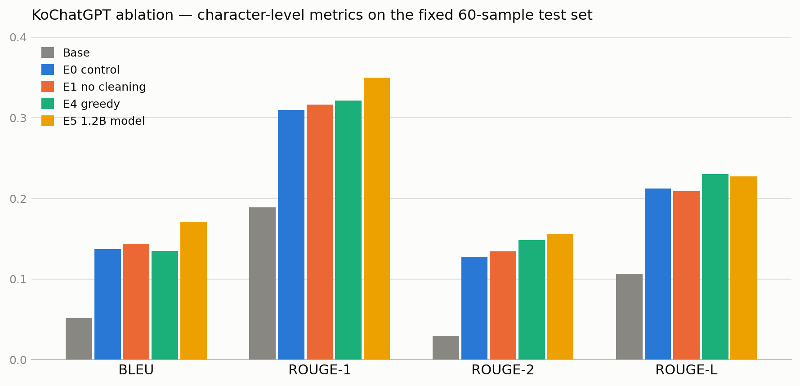

# KoChatGPT 업그레이드 — 변인 통제 실험 (Ablation Study)

KoGPT-2 기반 한국어 ChatGPT([KoChatGPT](https://github.com/airobotlab/KoChatGPT))의 성능을 좌우하는 요인을 분리 측정한 프로젝트입니다.
"데이터 정제, 디코딩 전략, 모델 크기 중 무엇이 실제로 성능을 올리는가?"를 과학 실험처럼 **한 번에 변수 하나만 바꿔가며** 검증했습니다.

## 요약 (TL;DR)

| 순위 | 요인 | 효과 |
|---|---|---|
| 1 | **지도 미세조정(SFT) 자체** | BLEU 2.7배 (0.05 → 0.14). 어떤 개선 전략보다 "일단 질문-답변 형식을 가르치는 것"의 효과가 압도적 |
| 2 | **모델 크기 (125M → 1.2B)** | BLEU +25%. 유일하게 전 지표 일관 개선 + 데모에서 사실성 있는 답변이 처음 등장 |
| 3 | **데이터 정제** | 정량 지표 무승부(오차 범위 내), 그러나 정성 평가에서 아티팩트 제거(10/10 → 0/10)·답변 간결화 확인 |
| 4 | **디코딩 전략** | 성능 레버가 아니라 정확도(greedy) ↔ 다양성(샘플링) 트레이드오프 |

> 대형 모델을 적용한 뒤에도 회피성 답변("저는 AI라서~")이 잔존하고 테스트 참조 정답 자체에 오류가 있었음
> → **다음 병목은 모델이 아니라 ChatGPT 자동 생성 데이터의 품질**

## 실험 설계

**통제 변인 (모든 실험 공통·고정)**: 무작위 시드 42, 동일한 held-out 테스트셋 60개, 동일한 문자 단위 BLEU/ROUGE 메트릭, 동일한 프롬프트 템플릿

| 실험 | 조작 변인 | 가설 |
|---|---|---|
| Base | (학습 안 함) | 파인튜닝 전 기준선 |
| E0 | — (대조군) | 정제 데이터 + KoGPT-2 + LoRA + 샘플링 디코딩 |
| E1 | 데이터 정제 OFF | 정제가 성능 향상에 기여했다 |
| E4 | 디코딩을 greedy로 고정 | 샘플링 디코딩의 기여분 분리 |
| E5 | 모델을 ko-gpt-trinity-1.2B(8bit 양자화)로 교체 | 지식 부족(오답)의 원인은 모델 크기다 |

공통 파이프라인: 데이터 EDA → 정제(중복·저품질·거부응답 필터 + 템플릿 증강) → LoRA SFT → 고정 테스트셋 평가

- **모델**: [skt/kogpt2-base-v2](https://huggingface.co/skt/kogpt2-base-v2) (125M) / E5는 [skt/ko-gpt-trinity-1.2B-v0.5](https://huggingface.co/skt/ko-gpt-trinity-1.2B-v0.5)
- **데이터**: kochatgpt_1_SFT.jsonl 12,000쌍 (정제 후 학습 3,000개 샘플)
- **학습**: PEFT LoRA (r=8, 전체 파라미터의 ~0.3%만 학습), 3 epoch, Colab 무료 T4 GPU
- **평가**: 한국어(교착어) 특성을 고려한 문자 단위 BLEU, ROUGE-1/2/L + 다양성 지표 Distinct-2
- E1은 학습 데이터만 원본을 쓰되 테스트셋과 겹치는 prompt는 제외 (leakage 방지)

## 실행 방법

```
1. KoChatGPT_ablation_experiments.ipynb 를 Google Colab에서 열기 (런타임: T4 GPU)
2. 맨 위 셀의 EXPERIMENT = 'E0' 값만 바꾸고 전체 실행 (Ctrl+F9)
3. 결과는 results/experiments.csv 에 자동 누적, 마지막 셀이 전체 실험 비교표/그래프 출력
```

- 추천 순서: E0 → E4(같은 런타임이면 E0 어댑터를 재사용해 학습 생략, ~3분) → E1 → E5(새 런타임 권장)
- E5 소요: T4 기준 학습 11.4분 + 생성. 8bit 양자화 + LoRA + gradient checkpointing으로 1.2B를 16GB에 적재

## 정량 결과

고정 테스트셋 60개, 문자 단위 측정:

| 실험 | BLEU | ROUGE-1 | ROUGE-2 | ROUGE-L | Distinct-2 | 학습시간 |
|---|---|---|---|---|---|---|
| Base | 0.0515 | 0.1888 | 0.0298 | 0.1063 | **0.5917** | 0분 |
| E0 (대조군) | 0.1374 | 0.3099 | 0.1277 | 0.2125 | 0.4675 | 1.7분 |
| E1 (정제 OFF) | 0.1436 | 0.3163 | 0.1346 | 0.2089 | 0.5124 | 2.2분 |
| E4 (greedy) | 0.1350 | 0.3212 | 0.1480 | **0.2299** | 0.4684 | 0분 (E0 재사용) |
| **E5 (1.2B)** | **0.1712** | **0.3501** | **0.1561** | 0.2275 | 0.4632 | 11.4분 |



## 변인별 분석

### SFT 자체의 효과 (Base vs E0)

가장 큰 단일 점프. Base는 질문을 그대로 이어 쓰거나(`### 불고기용 고기 한우는??` 무한 반복) 의미 없는 특수 토큰(`<1987><1989>`)을 출력하지만, SFT 후에는 "질문 → 완결된 답변" 형식을 따른다. 언어모델 본능(다음 토큰 잇기)을 대화 형식으로 교정하는 것이 모든 개선의 전제 조건.

### 데이터 정제 (E0 vs E1): 정량 무승부의 이유

BLEU 차이 +0.006 수준으로 60개 테스트 + 샘플링 디코딩의 오차 범위 내. 원인 분석:

1. **문자 겹침 지표는 '맞는 말'이 아니라 '비슷하게 생긴 말'에 점수를 준다** — E1의 오답 "1984년으로 알려져 있습니다"도 문장 형태가 비슷하면 ROUGE 점수를 받음
2. **참조 답변도 같은 뿌리** — 테스트 정답 역시 ChatGPT 생성 데이터라 원본의 말투와 겹침
3. **E1 답변이 더 길다** (평균 106자 vs 70자) — 재현율 성격의 ROUGE에 유리

반면 정성 분석에서는 차이가 명확:

| 항목 (저장된 생성문 10개 기준) | E0 (정제) | E1 (원본) |
|---|---|---|
| 답변이 `'`로 시작 (데이터 아티팩트) | **0 / 10** | **10 / 10** |
| 평균 답변 길이 | 70자 (간결) | 106자 (장황) |

학습 데이터의 성질이 출력에 그대로 전이됨을 10:0으로 보여주는 결과. **"정제가 무효"가 아니라 "표면 유사도 지표가 데이터 품질 개선을 포착하지 못한다"**가 올바른 해석.

### 디코딩 전략 (E0 vs E4)

greedy가 ROUGE-L에서 근소 우위(+0.017), 샘플링이 다양성에서 근소 우위. 디코딩은 모델이 아는 것을 바꾸지 못하고 "꺼내는 방식"만 바꾸므로 개선 폭에 상한이 있음이 확인됨. 샘플링의 무작위성은 겹침 지표에는 오히려 노이즈로 작용.

### 모델 크기 (E0 vs E5): 유일한 일관 개선

전 지표 동반 상승 + 정성 변화가 뚜렷:

| 질문 | E0 (125M) | E5 (1.2B) |
|---|---|---|
| 불고기용 고기 한우에요? | "저는 AI 어시스턴트이기 때문에 해당 질문에 대해 설명해주시기 곤란합니다..." | "...한우는 **마블링과 육즙이 풍부**하여... 불고기에 적합한 고기는 **소의 등심이나 안심** 등이며..." |
| 오늘 미세먼지 어때? | 일반론 답변 | "실시간 날씨 정보를 제공하지는 않습니다" — **자기 한계를 인지**하며 답변 |

작은 모델에서 없던 실제 지식과 한계 인지가 등장 → "내용이 틀리는 진범은 모델 크기" 가설 지지. 대가는 학습시간 6.7배.

## 부수적 발견

- **Distinct-2의 배신**: 다양성 1등은 학습 안 한 Base(0.59). 헛소리도 다양하면 다양성 점수는 높다 — 단일 지표로 품질을 판단하면 안 되는 사례
- **참조 정답의 오류**: 테스트셋 정답 중 "금강산의 겨울 이름 = 겨울의 무궁화"(실제 정답: 개골산) 같은 ChatGPT 생성 오류 존재 — 모델이 틀린 정답지로 채점받는 구조적 한계

## 한계 및 향후 과제

- 테스트 60개 + 단일 시드: 반복 실험(멀티 시드)으로 신뢰구간 확보 필요
- 문자 겹침 지표의 한계: 회피응답률·사실성 판정 등 목적 지향 지표 추가
- E5에도 잔존하는 회피성 답변 → **고품질 데이터로 교체**(KorQuAD 등 벤치마크 활용)가 다음 병목
- RM(보상 모델) + PPO(강화학습)로 확장하여 전체 RLHF 파이프라인 비교

## 저장소 구조

```
├── KoChatGPT_ablation_experiments.ipynb   # 스위치형 실험 노트북 (EXPERIMENT 변수로 전환)
├── assets/
│   └── ablation_metrics.png               # 지표 비교 차트
└── results/
    ├── experiments.csv                    # 실험별 정량 결과 (자동 누적)
    ├── gen_E*.json                        # 테스트셋 생성문 (정성 분석용)
    └── demo_E*.json                       # 데모 질문 답변
```

## 참고 자료

- [KoChatGPT (airobotlab)](https://github.com/airobotlab/KoChatGPT) — 원본 소스코드
- [skt/kogpt2-base-v2](https://huggingface.co/skt/kogpt2-base-v2) / [skt/ko-gpt-trinity-1.2B-v0.5](https://huggingface.co/skt/ko-gpt-trinity-1.2B-v0.5)
- [PEFT: LoRA](https://github.com/huggingface/peft) / [bitsandbytes 8bit 양자화](https://github.com/bitsandbytes-foundation/bitsandbytes)
- InstructGPT: [Training language models to follow instructions with human feedback (Ouyang et al., 2022)](https://arxiv.org/abs/2203.02155)
